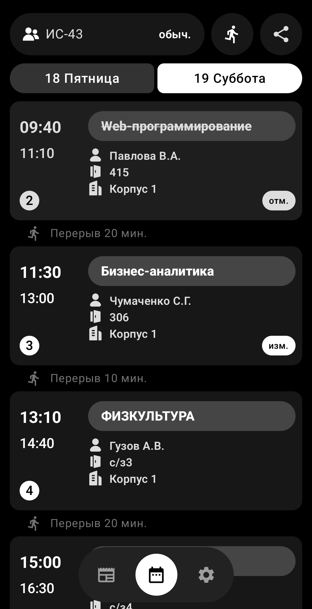
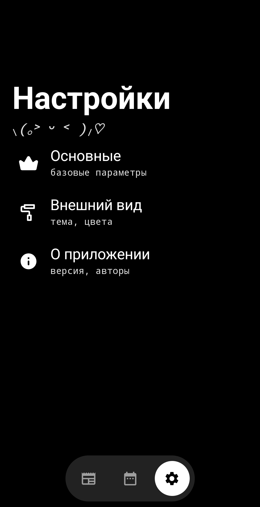
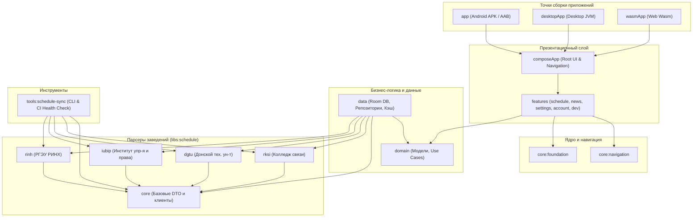

<div align="center">

<br />

<!-- 1. Закругленная иконка проекта -->


# SCHEDULE

Кроссплатформенный клиент и экосистема синхронизации академического расписания для студентов и преподавателей.

<br />

<!-- 2. Информационные чипсы (height="24") -->


<br />

<div>
<!-- 4. Витрина (Showcase) -->

&nbsp;

&nbsp;

</div>

<br />

<!-- 3. Кнопки дистрибуции и установки -->
[](https://github.com/whatrushki/schedule/releases)
&nbsp;
[](https://whatrushki.github.io/schedule/)
&nbsp;
[](https://github.com/whatrushki/schedule/packages)

<br />
</div>

---

### О проекте

WHAT Schedule — мультиплатформенная экосистема для получения, парсинга и отображения расписания учебных заведений. Проект объединяет гетерогенные источники данных (от закрытых веб-API и XLSX-файлов до облачных таблиц) в единую нормализованную модель данных с поддержкой оперативного отслеживания замен, звонков и академических новостей.

Архитектура построена на базе Kotlin Multiplatform и Compose Multiplatform, обеспечивая консистентный пользовательский опыт и единый стек бизнес-логики на Android, десктопных операционных системах (Windows, macOS, Linux) и в браузере через WebAssembly.

#### Ключевые возможности

* **Мультипровайдерная синхронизация**  
  Автономные клиенты парсинга для каждого учебного заведения с извлечением групп, преподавателей, аудиторий и расписания звонков.

* **Автоматическое наложение замен**  
  Интеллектуальное сопоставление базового расписания с оперативными изменениями, вычисление добавленных, отмененных и перенесенных занятий.

* **Академические новости и галереи**  
  Интегрированная лента новостей учебных заведений с адаптивной версткой, предпросмотром медиафайлов и полноэкранным просмотром деталей.

* **Автономность и фоновый кэш**  
  Многоуровневое кэширование расписания и метаданных для бесперебойной работы клиентов в условиях нестабильной сети или недоступности серверов учреждений.

* **Еженедельный мониторинг стабильности**  
  Автоматизированный CI-конвейер проверки доступности парсеров с независимой матрицей исполнения и мгновенными алертами в Telegram.

#### Поддерживаемые учебные заведения

| Организация | Модуль | Источник данных | Статус |
| :--- | :--- | :--- | :--- |
| **РКСИ** — Ростовский-на-Дону колледж связи и информатики | `:libs:schedule:rksi` | XLSX, Google Таблицы, Веб | Поддерживается |
| **ДГТУ** — Донской государственный технический университет | `:libs:schedule:dgtu` | Внутренний REST API | Поддерживается |
| **РГЭУ (РИНХ)** — Ростовский государственный экономический университет | `:libs:schedule:rinh` | Официальный веб-сервис | Поддерживается |
| **ИУБиП** — Институт управления, бизнеса и права | `:libs:schedule:iubip` | Информационный портал | Поддерживается |
| **ЮФУ (Мехмат)** — Институт математики, механики и КН им. И.И. Воровича | `:libs:schedule:sfedu` | Официальный REST API / Веб | Поддерживается |

---

### Инженерная спецификация

#### Стек и инструменты

<p align="left">
  
  
  
  
  
  
</p>

#### Архитектура



#### Подключение библиотек парсеров (Maven Packages)

```kotlin
// settings.gradle.kts
dependencyResolutionManagement {
    repositories {
        maven {
            url = uri("https://maven.pkg.github.com/whatrushki/schedule")
            credentials {
                username = System.getenv("GITHUB_ACTOR")
                password = System.getenv("GITHUB_TOKEN")
            }
        }
    }
}

// build.gradle.kts
dependencies {
    implementation("app.what.schedule:core:1.3.4")
    implementation("app.what.schedule:rksi:1.3.4")
    implementation("app.what.schedule:dgtu:1.3.4")
    implementation("app.what.schedule:iubip:1.3.4")
    implementation("app.what.schedule:rinh:1.3.4")
    implementation("app.what.schedule:sfedu:1.3.4")
}
```

#### Сборка и запуск

```bash
# Клонирование репозитория
git clone https://github.com/whatrushki/schedule.git
cd schedule

# Сборка Android APK
./gradlew assembleDebug

# Запуск Desktop-приложения
./gradlew :desktopApp:run

# Запуск Web (Wasm) в dev-режиме
./gradlew :wasmApp:wasmJsBrowserDevelopmentRun
```


---

### Обратная связь и участие

* Ошибки и запросы функционала оформляются через [GitHub Issues](https://github.com/whatrushki/schedule/issues).
* Официальные каналы коммуникации и вопросы разработки: [Telegram](https://t.me/whatrushki).

<br />

<div align="center">
<sub>© WHAT Technologies. Все права защищены. Лицензия MIT.</sub>
</div>
